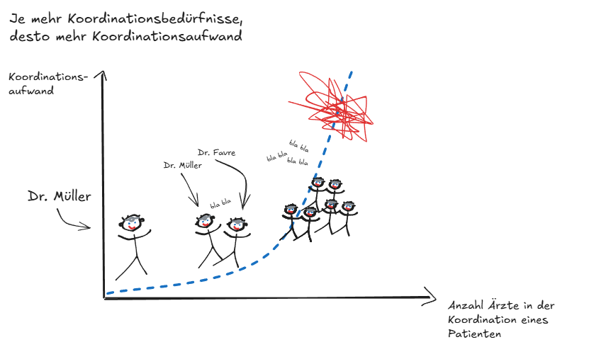
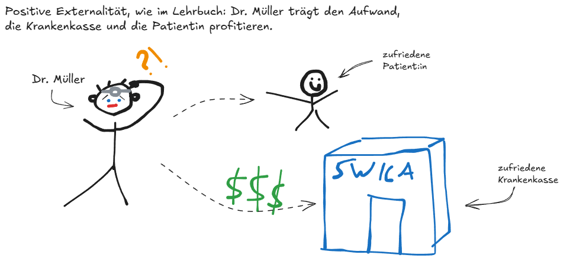

*Anfang September durfte ich zusammen mit meinem Kollegen Christian Frei den Einführungskurs im CAS ["Koordinierte Versorgung im Gesundheitswesen"](https://www.zhaw.ch/de/sml/weiterbildung/detail/kurs/cas-koordinierte-versorgung-im-gesundheitswesen) an der ZHAW durchführen. Das war für mich eine schöne Gelegenheit, meine Gedanken einzuordnen, die ich auch in meiner Arbeit bei SWICA jeden Tag anwende. Hier ein kleiner Beitrag dazu (eine ausführlichere Version und die Literatur findet man im Kursmaterial).*

*Dieser Beitrag gibt meine persönliche Meinung wieder, nicht die offizielle Position von SWICA. Mithilfe von Claude auf Deutsch verfasst.*

🎯 **TL;DR**: Skaleneffekte sprechen für Integration, aber ab einem gewissen Punkt wird Koordination zu komplex und zu teuer. Gleichzeitig lohnt sich Koordination für den einzelnen Leistungserbringer nicht, selbst wenn sie fürs System günstiger wäre. Ein klassisches Marktversagen durch Externalitäten und Fehlanreize, die durch bessere Vergütungsmodelle korrigiert werden können.

---

\

## Man braucht mehr koordinierte und integrierte Versorgung

Wenn man die Berichte und Präsentationen der Akteure des Gesundheitswesens in der Schweiz aus den letzten 15 Jahren liest, kommt man immer auf die "Aufforderung", **integrierte Versorgung sei zu fördern**.

15 Jahre später hat man das Gefühl, die Situation sieht immer gleich aus. Warum entsteht sie nicht von selbst?

Die koordinierte Versorgung ist offensichtlich sinnvoll: Die Gesundheitskosten steigen (+60% in den letzten 15 Jahren), die Qualität lässt sich mit zusätzlichen Mitteln kaum mehr proportional steigern, und 20% der Versicherten (oft multimorbide Patienten mit hohem Koordinationsbedarf[^1]) generieren 80% der Kosten. **Würde man genau diese 20% besser koordiniert versorgen, hätte man einen starken Business Case.**

[^1]: Siehe z.B. die [Studie von Stucki et al. 2023](https://link.springer.com/article/10.1186/s12913-023-10124-3).

\

## Der Markt allein liefert nur wenig koordinierte Versorgung

Zwei Linien führen dazu: die Koordination selbst ist wegen Komplexität teuer, und die Anreize sind falsch gesetzt.

\

### Skaleneffekte treiben Integration, bis Komplexität sie stoppt

Die erste Linie ist rein produktionstheoretisch: Skaleneffekte, Verbundvorteile (Economies of Scope) und Prozesseffekte sprechen dafür, dass gebündelte Produktion billiger ist als fragmentierte. **Leistungserbringer haben deshalb einen Anreiz, sich zu integrieren und Leistungen unter einem Dach zu koordinieren.** *So far so good.*

**Nach einem gewissen Punkt kehrt sich das um**: Die Grenzkosten steigen, Skalieren lohnt sich nicht mehr, und der Leistungserbringer zahlt mit "diseconomies of scale and scope", am stärksten bei komplexen, multimorbiden Fällen, wo Koordination am meisten bringen würde. Für einen "normalen" Diabetiker deckt ein Disease-Management-Programm die Koordination gut ab. Sobald aber Komorbiditäten dazukommen, passt das Programm nicht mehr, und die Koordination wird schnell viel komplexer. Deshalb entstehen gerade dort aus sich heraus keine koordinierenden Strukturen, am wenigsten im ambulanten Bereich, wo die einzelne Praxis zu klein ist, um diese Komplexität selbst zu bewältigen.

Je mehr Akteure an der Koordination beteiligt sind, desto stärker steigt diese Komplexität. Das zeigt die folgende Grafik als Beispiel (persönliche Interpretation 😎). Nehmen wir an, der Koordinationsaufwand steigt näherungsweise mit N·(N−1)/2: Bei N beteiligten Ärzten wächst die Zahl möglicher Abstimmungsbeziehungen dann quadratisch, nicht linear.

{fig-align="center" fig-alt="Grafik zur koordinierten Versorgung" width="70%"}

\

### Wer koordiniert, zahlt für den Nutzen aller

Die zweite Linie betrifft die Anreize selbst: In einem Tarifsystem, in dem Koordinationsaufwand kaum tarifiert wird, ist die Übernahme von Koordinationsleistungen eine positive Externalität. **Die Organisation, die integriert und koordiniert, trägt die Kosten, aber die Vorteile werden von allen geteilt** (andere Ärzte, Krankenkasse, Kostenträger). Das ist ein klassisches Marktversagen. Die Externalität ist besonders stark, wenn die Koordination über mehrere Organisationen hinweg geht: In diesem Fall lässt sich die Kostenlast nicht einmal mehr einer einzelnen Gegenpartei zuordnen.

{fig-align="center" fig-alt="Eigene Darstellung der positiven Externalität" width="70%"}

Dazu kommt das Trittbrettfahrerverhalten (free-riding): Die Organisation, die integriert und koordiniert, trägt die Kosten, aber andere profitieren davon, ohne etwas beizutragen.

Diese Schieflage zeigt sich auch im Tarifsystem selbst: Unter einem Einzelleistungstarif (Fee-for-Service) liegt der Tarif über den Grenzkosten. Das lohnt sich für zusätzliche, einzeln abrechenbare Leistungen, nicht aber für Koordination, die sich kaum tarifieren lässt. Der Anreiz zielt deshalb auf angebotsinduzierte Nachfrage (supplier-induced demand) statt auf Koordination: **Leistungserbringer erbringen eher mehr Einzelleistungen, als sich mit anderen abzustimmen.**

Beide Linien zusammen ergeben das vollständige Bild: unkoordinierte Produktion ist teurer, und niemand hat einen individuellen Anreiz, das zu ändern.

\

## Wir setzen bei den Anreizen an

Die Lösung hat zwei Wege: Marktdruck, der die Kostenstruktur der Leistungserbringer verändert, und neue Anreize durch Regulierung oder Vergütungsmodelle.

Über den Marktdruck wissen wir viel: Fachkräftemangel, Digitalisierung, steigende Kosten, steigende Prävalenz von nicht-übertragbaren Krankheiten, Zugang zur Grundversorgung. All das zwingt die Leistungserbringer, ihre Kostenstruktur zu überdenken und sich vermehrt zu integrieren und zu koordinieren. Ob der Druck aktuell reicht, um systemische Veränderungen zu bewirken, ist eine andere Frage. In der Schweiz ist aber der Druck anscheinend noch nicht so spürbar, dass man etwas notwendigerweise tun müsste.

Neue Anreize gegen dieses Marktversagen liegen beim Kostenträger und beim Regulator, vor allem bei der Vergütung. Daran arbeiten wir bei SWICA. Solange Tarife pro Akt (Einzelleistung) oder pro Fall (Fallpauschale) bezahlt werden, ohne dass Koordination entschädigt wird, bleibt der Anreiz schwach. **Deshalb entwickeln wir "shared-savings"-Modelle, die die Vorteile der Koordination direkt an die Leistungserbringer zurückgeben**, und setzen das über unsere Managed-Care-Verträge um.

Ein weiterer Hebel: die Vergütungslogik selbst auf die Population und den Zeitverlauf auszurichten, etwa mit Kopfpauschalen wie in den ersten Managed-Care-Modellen. Damit verschiebt sich der Anreiz Richtung Koordination. Mein 🧂 zu Kapitation in der Schweiz: Ich bin aktuell skeptisch, dazu mehr in einem anderen Blogpost...

\

---

Der Punkt, den ich den Teilnehmenden des CAS am meisten mitgeben möchte: **koordinierte Versorgung ist nicht nur ein Organisationsproblem, sondern ein Anreizproblem**. Lösungen dazu liegen nicht nur bei den Leistungserbringern, sondern auch bei den Kostenträgern.

\

{fig-align="center" fig-alt="Selfie vor dem Eingang der ZHAW" width="60%"}