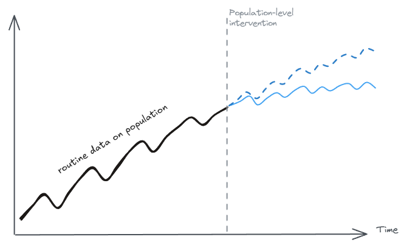
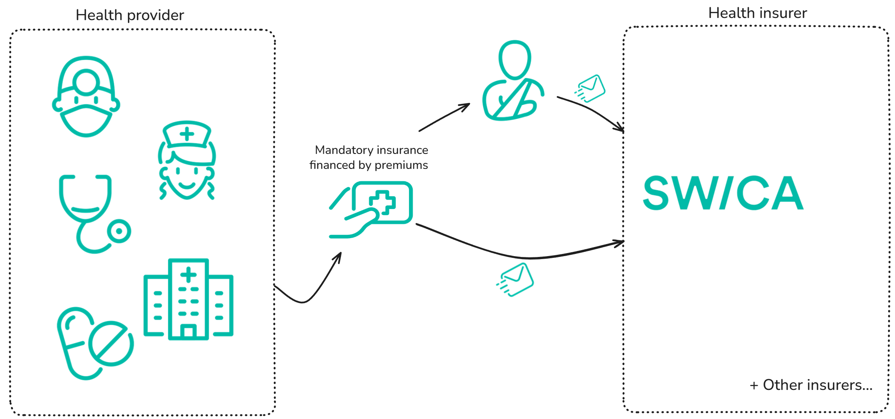
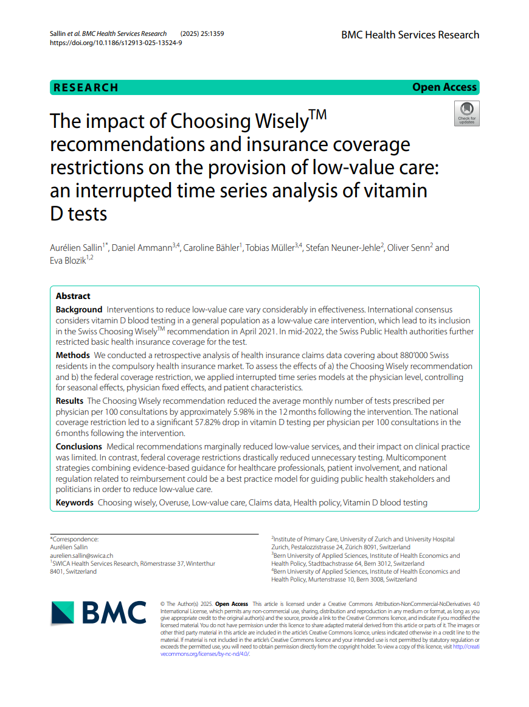
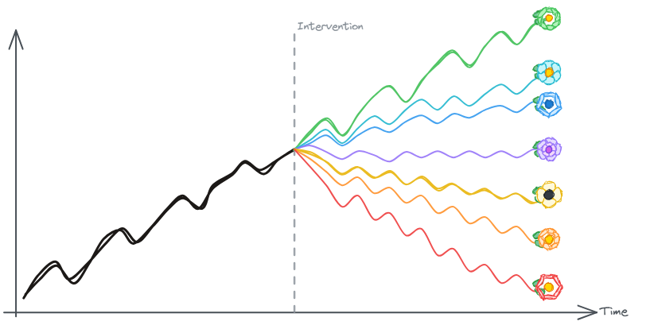
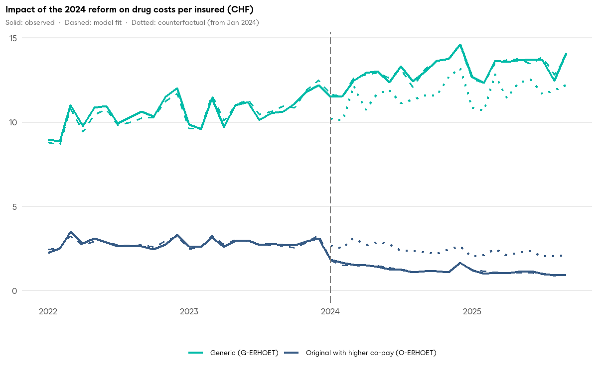

```{r set-options, echo=FALSE, cache=FALSE, warning=FALSE}
options(width = 100)
library(knitr)
knitr::opts_chunk$set(class.source = "chunkstyle")
```

```{r prepare-figures}
#| output: false
#| echo: false

library(ggplot2)
library(dplyr)
library(readr)

dataGraph <- readRDS("data/dataGraph.rds")
dfgraph <- dataGraph$dfGraph_long
counterfactualM <- dataGraph$counterfactual_long
out <- dataGraph$out
dfgraph <- rename(dfgraph, "y" = y1_)

plot_vitd_masked <- function(
    dfgraph,
    counterfactualM,
    mask_from = NULL,
    mask_counterfactual_from = NULL,
    x = 0.8
) {
    # Filter data based on mask_from parameter instead of using rectangles
    dfgraph_filtered <- if (!is.null(mask_from)) {
        subset(dfgraph, time <= mask_from)
    } else {
        dfgraph
    }

    # Create counterfactual dataframe
    counterfactual_df <- data.frame(
        time = dfgraph$time,
        counterfactual = counterfactualM
    )

    # Filter counterfactual data if needed
    if (!is.null(mask_counterfactual_from)) {
        counterfactual_df <- subset(counterfactual_df, time <= mask_counterfactual_from)
    }

    # Filter counterfactual by mask_from as well
    if (!is.null(mask_from)) {
        counterfactual_df <- subset(counterfactual_df, time <= mask_from)
    }

    p <- ggplot(dfgraph, aes(y = y * 100, x = time)) +
        geom_line(
            data = dfgraph_filtered,
            aes(
                color = "Observed",
                size = "Observed",
                linetype = "Observed"
            )
        ) +
        geom_line(
            data = counterfactual_df,
            aes(
                y = counterfactual * 100,
                color = "Counterfactual",
                size = "Counterfactual",
                linetype = "Counterfactual"
            )
        ) +
        geom_line(
            data = subset(dfgraph_filtered, time <= 0),
            aes(
                y = pred * 100,
                color = "Predicted",
                size = "Predicted",
                linetype = "Predicted"
            )
        ) +
        geom_line(
            data = subset(dfgraph_filtered, time >= 0),
            aes(
                y = pred * 100,
                color = "Predicted",
                size = "Predicted",
                linetype = "Predicted"
            )
        ) +

        scale_linetype_manual(
            name = "",
            values = c("Observed" = 1, "Predicted" = 1, "Counterfactual" = 4)
        ) +
        scale_size_manual(
            name = "",
            values = c(
                "Observed" = x * 0.8,
                "Predicted" = x * 1,
                "Counterfactual" = x * 1.25
            )
        ) +
        scale_color_manual(
            name = "",
            values = c(
                "Observed" = "grey40",
                "Predicted" = "#E22920",
                "Counterfactual" = "#01BBA8"
            )
        ) +
        scale_x_continuous(
            limits = c(-50, 18),
            breaks = c(-50, -39, -27, -15, -3, 0, 9, 15, 21) - 15,
            labels = c(
                "Jan.\n2017",
                "Jan.\n2018",
                "Jan.\n2019",
                "Jan.\n2020",
                "Jan.\n2021",
                "Apr.\n2021",
                "Jan.\n2022",
                "Jun.\n2022",
                "Jan.\n2023"
            )
        ) +
        scale_y_continuous(
            limits = c(1.5, 7),
            breaks = seq(2, 7, 1)
        ) +
        annotate(
            "rect",
            xmin = -28,
            xmax = -24,
            ymin = -Inf,
            ymax = Inf,
            alpha = 0.1,
            fill = "#00857C"
        ) +
        geom_text(
            aes(x = -26, y = 1.8, label = "COVID19 \nLockdown"),
            color = "#00857C",
            size = x * 3
        ) +
        labs(
            y = "Monthly Vitamin D test prescriptions per 100 consultations",
            x = NULL
        ) +
        theme_classic() +
        theme(
            plot.background = element_rect(fill = "white", color = NA),
            panel.background = element_rect(fill = "white", color = NA),
            legend.background = element_rect(fill = "white"),
            legend.position = "bottom",
            panel.grid.major.x = element_line(color = "#e9ecef"),
            panel.grid.major.y = element_line(color = "#e9ecef"),
            axis.text.x = element_text(size = x * 13),
            axis.text.y = element_text(size = x * 13),
            axis.title = element_text(size = x * 14),
            legend.text = element_text(size = x * 13)
        )

    # Add vertical lines conditionally based on data support
    if (is.null(mask_from) || mask_from >= -15) {
        p <- p + geom_vline(
            xintercept = -15,
            color = "#E22920",
            lty = 20,
            linewidth = x * 1.5
        )
    }

    if (is.null(mask_from) || mask_from >= 0) {
        p <- p + geom_vline(
            xintercept = 0,
            color = "#675482",
            lty = 20,
            linewidth = x * 1.5
        )
    }

    p
}
```


## Population-level interventions with administrative data: a common but challenging setting

<div style="margin-top: 1em;"></div>

::: {.fragment}
##### Need for causal analysis...
- **Who**: public health authorities, researchers, and insurers
- **Why**: accountability, quality improvement, and policy design
:::

::: {.fragment}
##### ... in an imperfect world...
- **No control group**: population-level policies affect everyone simultaneously, ruling out randomized experiments and difference-in-differences designs.
- **Routine data**: claims data collected for billing/administrative purposes, not purpose-built for research
:::

<div style="margin-top: 3em;"></div>

::: {.fragment}
#### 🎤 This talk
- How we think about the problem from the perspective of SWICA
- One empirical illustration (Vitamin D testing and low-value care)
:::


::: {.notes}
"This is the problem I face in my work."
:::


## A credible control group is rarely available

<div style="margin-top: -1em;"></div>

:::: {.columns}
::: {.column width="50%"}
::: {.fragment}
#### **Problem**: in many real-world settings, population-level policies affect all units simultaneously
:::

<div style="display: flex; flex-direction: column; gap: 0; line-height: 0;">
<div class="fragment" style="display: flex; align-items: center; gap: 0.6em; margin: 0; padding: 0;">

<div style="font-size:0.8em; line-height: 1.3;">National changes in clinical guidelines</div>
</div>
<div class="fragment" style="display: flex; align-items: center; gap: 0.6em; margin: 0; padding: 0;">

<div style="font-size:0.8em; line-height: 1.3;">Changes in physician compensation</div>
</div>
<div class="fragment" style="display: flex; align-items: center; gap: 0.6em; margin: 0; padding: 0;">

<div style="font-size:0.8em; line-height: 1.3;">Public health campaigns</div>
</div>
</div>

:::

::: {.column width="50%"}

::: {.fragment}
#### **Pragmatic solution**: **interrupted time series** (ITS)
:::

::: {.fragment}
- **Idea**: exploits the pre-intervention trend to construct a counterfactual
:::

<div style="margin-top: -1em;"></div>

::: {.fragment}
{width=80%}
:::

<div style="margin-top: -1.5em;"></div>

::: {.fragment}
- **Challenge**: strong causal assumptions (no concurrent interventions, trend continuity) and correct functional form specification[*](#assumptions)
:::

:::
::::


::: {.notes}
Problem: No staggered intervention, no control group, no Diff-in-Diff. No CREDIBLE control group.
No untreated units: forecast the counterfactual.

Example: Congenital syphilis (mother-to-child transmission or vertical transmission of syphilis) causes damage to the fetus if the mother's infection is not detected and properly treated during pregnancy. October of 2016: “Syphilis No!” Project in Brazil.

Gold standard: A randomized experiment is ideal, but rarely feasible when a policy rolls out across an entire population at once.

Second best: Quasi-experimental designs such as difference-in-differences require untreated units as a comparison group, which a universal policy eliminates by construction.

Our approach: Interrupted time series exploits the pre-intervention trend to construct a counterfactual and measures the deviation from it once the policy takes effect.
:::


## Claims data support policy evaluation with no control group

<div class="fragment" style="text-align:center; overflow:visible;">

</div>

::: {.incremental}
- **Coverage**: entire Swiss population enrolled under mandatory health insurance (>130 million invoices/year)
- **Administrative records**: byproduct of the billing and reimbursement process (not purpose-built for research).
- **Strengths**: large number of units (physicians, patients, consultations) and services billed observed over time.
- **Limitations**: longitudinal tracking complicated by switchers; regional fragmentation of insurers; no clinical information.
<div style="margin-top: 1em;"></div>

- **⚡Key advantage for ITS**: cross-sectional variation to predict each unit's counterfactual trajectory.
:::


# ITS used with administrative data presents many advantages, but...


## ITS is widely used but implemented with high risk of bias

::: {.incremental}

> **"The risk of bias for ITS studies was high for 53.3% and very high for 19.2%."**<br><span style="display: block; text-align: right;">@hategeka2020use, N = 120, 1990-2020</span>

<div style="margin-top: 2em;"></div>

- Concurrent changes confound the intervention.
- Time series techniques misapplied.
- Trends and time-dependent covariates misspecified.
- ...

<div style="margin-top: 2em;"></div>

#### Sound implementation guidance is needed.{.fragment}

:::


## Here is how we address these challenges

:::: {.columns}
::: {.column width="55%"}

<div style="margin-top: 2em;"></div>


- **User's guide**: recommendations for ITS implementation, identifying assumptions, and modeling choices.
- **Open-access software (`itscausal`)**: tailored to wide panel data (many units, few periods), with a rolling-window ML forecasting approach.
- **Approach validation**: simulations across different data-generating processes, benchmarking against published research.
- **Ongoing work**: 2024 co-payment reform and generic drug substitution in Switzerland (together with ZHAW).

:::
::: {.column width="45%"}
::: {style="text-align: center;"}
{width=100%}
:::
:::
::::

::: {.notes}
Use machine learners and ensemble methods to train models on pre-intervention data. Forecast onto the post-intervention period. Compare actual outcomes with predicted counterfactuals to estimate causal effects. Aggregate results for the desired population and time period.

- **ML learners** (random forest, gradient boosting, neural networks, catboost, lstm) with hyperparameters tuning.
- **Rolling-window approach** for post-intervention forecasts with time-variant and invariant predictors.
- Effect computed as the difference between the observed and the forecasted values.
- **Simulations** of different data-generating processes show good performance.
:::


# An example 💉


## 💉 Two policies targeted the same low-value practice {.incremental}

<div style="margin-top: 1em;"></div>

:::: {.columns}
::: {.column width="60%"}
<div style="margin-top: 2em;"></div>

::: {.fragment}
- **Context**: Vitamin D testing rates nearly doubled between 2013 and 2020 in Switzerland.
- **Problem**: Clinical guidelines advised against routine testing (low-value care, ~30% of healthcare in high-income countries)
:::
::: {.fragment}
- **Intervention 1 (April 2021)**: The *Smarter Medicine* initiative added Vitamin D testing to its list of procedures to avoid.
- **Intervention 2 (July 2022)**: The Federal Office of Public Health restricted reimbursement, shifting costs to out-of-pocket.
:::
::: {.fragment}
- **Results**: ...
:::
<!--- **Results**: Guidelines reduced testing by 6%, while the reimbursement restriction cut it by 58% within six months.-->
:::
::: {.column width="40%"}
::: {style="position: relative; display: inline-block;"}
<div style="margin-top: -2em;"></div>
{width=70% .fragment}

{width=70% .fragment style="position: absolute; top: 10%; left: 10%;"}
:::

:::
:::
<!-- end columns -->


<div style="height: -10em;"></div>


## Testing rates kept rising despite low clinical value {transition="fade" transition-speed="fast"}

::::: {.columns}
:::: {.column width="75%"}
```{r}
#| fig.width: 10
#| fig.height: 6
plot_vitd_masked(dfgraph, counterfactualM, mask_from = -16)
```
::::
:::: {.column width="25%"}
**Trend**: Vitamin D test prescriptions rose by 20% between 2018 and 2021
::::
:::::


## Clinical recommendations reduced testing by 6% {transition="fade" transition-speed="fast"}

::::: {.columns}
:::: {.column width="75%"}
```{r}
#| fig.width: 10
#| fig.height: 6
plot_vitd_masked(dfgraph, counterfactualM, mask_from = -1, mask_counterfactual_from = 0)
```
::::
:::: {.column width="25%"}
{width=80%}

- **Intervention**: Smarter Medicine recommendation.
- **Results**: the clinical recommendation reduced tests by **6%** in 12 months.<sup>*</sup>

::: aside
<sup>*</sup> Estimates adjusted for patient and physician characteristics. Robust to specifications with physician fixed effects. Results available in Sallin et al., 2025.
:::
::::
:::::

---

## Financial incentives reduced testing by 58% within six months {transition="fade" transition-speed="fast"}

::::: {.columns}
:::: {.column width="75%"}
```{r}
#| fig.width: 10
#| fig.height: 6
plot_vitd_masked(dfgraph, counterfactualM, mask_from = NULL)
```
::::
:::: {.column width="25%"}
{width=80%}

- **Intervention**: Federal Office of Public Health restricted coverage: patients pay out-of-pocket for routine tests
- **Results**: The number of tests per consultation **dropped by 58%** in 6 months
- **Savings**: Healthcare system savings were **15.65 million CHF** in 2022 alone (1.8 CHF per Swiss resident)
::::
:::::


## We can do a lot with population data and without control group

<div style="height: 1em;"></div>

::: {.columns}
::: {.column width="55%"}

::: {.fragment}
#### No control group is not the end of the world
Interrupted time series can estimate causal effects by leveraging the pre-intervention trend to construct a counterfactual, especially when rich panel data are available.
:::

::: {.fragment}
#### We build a practical solution
`itscausal` provides a guide for sound ITS implementation in real-world evidence.
:::
:::

::: {.column width="45%"}
::: {.fragment}
{width=100%}
:::
:::
:::


<div style="height: 1.5em;"></div>

<hr style="margin: 0px 0;color: #26351c;height: 0px;margin-bottom: 0px;">

:::: {.columns}
::: {.column width="12%"}
{height=80px width=auto}
:::
::: {.column width="9%"}
{height=80px width=auto}
:::
::: {.column width="30%"}
<div style="height: 0.8em;"></div>
🔗 [`itscausal` on GitHub](https://github.com/ASallin/itsCausal)<br>
🌐 [www.aureliensallin.ch](https://www.aureliensallin.ch)
:::
::::

---

---
# Appendix

---

## 💊 Co-payment reform shifted purchasing from brand-name to generic drugs *(ongoing)*

:::: {.columns}
::: {.column width="50%"}
{style="width: 100%; max-width: none;"}
:::

::: {.column width="50%"}
<div style="margin-top: 2em;"></div>

- **Context**: Switzerland among the lowest generic uptake rates in comparable countries.
- **Intervention (January 2024)**: co-payment for brand-name drugs from 20% to 40% when a generic substitute exists, while generics remain at 10%.
- **Data**: drugs in categories with available generic substitutes.
- **Results**:
  - +8% share of patients for generics, -40% share of patients for brand-name drugs
  - +12% costs for generics, -47% costs for brand-name drugs
:::
::::

---
## Identifying assumptions for ITS {#assumptions}

##### The following assumptions must hold (see @cerqua2024nocontrol):

1. There are no hidden forms of treatment leading to different potential outcomes (**weak SUTVA**).
2. **Additivity**: the treatment effect adds on top of what would have happened anyway, independently of the level of the counterfactual. It rules out multiplicative or interactive effects and it assumes the policy doesn't affect the variance of outcomes, only their level. Analogous to the "additive separability" assumption in difference-in-differences; parallel assumption is stated in levels, not ratios.
3. **No anticipation and no confounding**
    - Absence of anticipatory effects of the intervention on the covariates and the potential outcomes
    - Future covariates do not affect current potential outcomes
    - Covariates remain unaffected by the policy in the post-intervention period (post-treatment exogeneity of the covariates)
4. **Dynamic potential outcomes model**: the potential outcomes absent the policy (the "counterfactual") can be predicted using lagged values of the outcome and of the covariates.
5. **Post-intervention non-linear multi-step-ahead model**: the counterfactual can be predicted for multiple periods ahead using lagged values of the outcomes until the intervention, conditional expectations of the outcome after the intervention, and the covariates.

<!--  the potential outcome absent the policy is a flexible function of the past lags of the outcome, the contemporaneous covariates, and the past lags of covariates. The error term is a zero-mean, uncorrelated error term following a generic distribution.
-->

## References

::: {#refs}
:::


::: {.notes}
$$\begin{aligned} {y_{it}} &= {\beta _0} + {\beta _1}{t_{it}} + {\beta _2}{x_t} + {\beta _3}\left( {{t_{it}} \times {x_t}} \right) \\&\quad+ {\beta _4}{Z_{it}} + {\alpha _i} + {\gamma _t} + { \in _{it}} \end{aligned}$$

<span style="color: grey; font-weight: bold; font-size: 1.2em;">Linear model with time variable, treatment variables, individual controls and seasonality patterns

<span style="color: grey; font-weight: bold; font-size: 1.2em;">●</span> **Grey line** = Actual vitamin D tests prescribed monthly

<span style="color: #E22920; font-weight: bold; font-size: 1.2em;">●</span> **Red line** = Statistical model predictions

This is our econometric model for the interrupted time series analysis. The model includes time trends, intervention effects, and controls for both patient and physician characteristics.
:::
