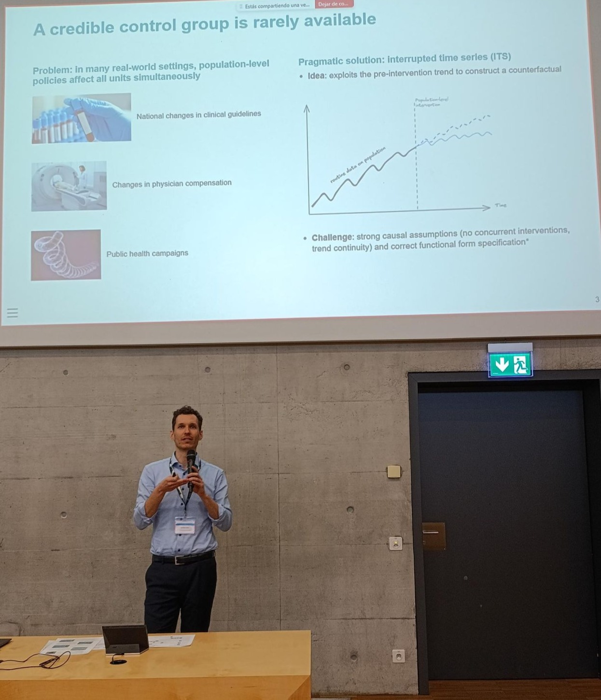

## Latest News

::: {layout="[40, 60]"}
::: {.column}
{style="width: 60%; height: auto;"}
:::

::: {.column}
### 🎤 **Keynote at the Causal Inference Symposium** (18 March 2026)

[2026 Symposium of Causal Inference in the Health Sciences](https://projects.unifr.ch/pophealthlab/?page_id=1561) organized by #PopHealthLab in Fribourg. Topic: *Measuring the Effects of Population-level Interventions Using Healthcare Claims Data* — interrupted time series, Swiss claims data, and the `itscausal` package.

[Slides](/presentations/fribourg2026.html){target="_blank"} | [Blog post](/posts/202603_fribourg/blog.html)
:::
:::

---

::: {layout="[60, 40]"}
::: {.column}
### 📰 **New Publication** (October 2025)

**"The impact of Choosing WiselyTM recommendations and insurance coverage restrictions on the provision of low-value care: an interrupted time series analysis of vitamin D tests"** published in *BMC Health Services Research*

[Read Study](https://bmchealthservres.biomedcentral.com/articles/10.1186/s12913-025-13524-9) | [Check my summary blog post (with cool graphs!)](/posts/2025-06-07-blog1/scroll.html)

\

#### 📊 **Key findings:**
Clinical recommendations alone are insufficient to reduce low-value care in the case of Vit D tests. Insurance coverage restrictions proved more effective than guidelines, reducing unnecessary vitamin D testing by 62% and saving 15.65 million CHF annually. However, coverage restrictions increase administrative burden and risk underuse.

\

#### 📺 **Media Coverage**

Our research on reducing unnecessary vitamin D testing has been featured in the ["Sonntagszeitung"](media/sonntagszeitung.jpg) (pdf version) and the ["Tages Anzeiger"](https://www.tagesanzeiger.ch/vitamin-d-tests-bag-spart-60-millionen-bei-gesundheitskosten-701517681555) ([pdf version](media/2025_10_27_Überversorgung.pdf))
:::

::: {.column}
\

\

{style="width: 70%; height: auto;"}
:::
:::

\

---

## Complete Academic Record

For a comprehensive list of publications and citations, visit my [Google Scholar profile](https://scholar.google.com/citations?user=buQosFUAAAAJ&hl=en).

