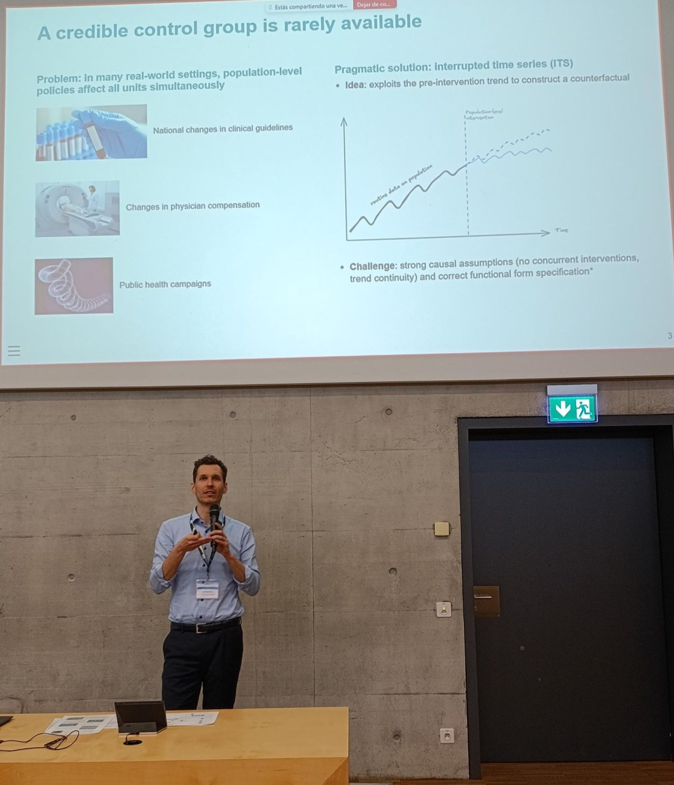
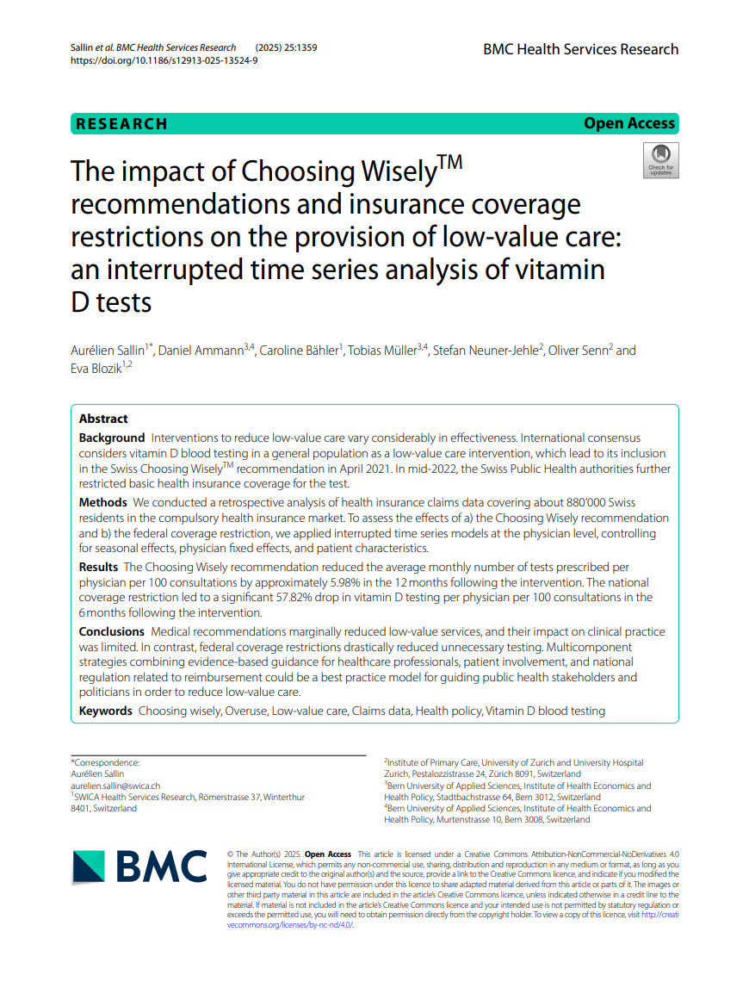

## Latest News

### Our brand new course "Introduction to Programming for Economists" at the University of St. Gallen just completed its first run (June 2026)

{style="width: 50%; height: auto; display: block; margin: 0 auto;"}

Some months ago, my colleague Franziska Bender and I were asked to build, from scratch, a full programming course for our ~230 Undergrad Econ students at University of St.Gallen. The goal: give them the basic toolkit they'll need for research and work as economists. The course focuses on collaboration, code reusability, and reproducibility. In the era of AI and vibe coding, we decided to focus less on coding in the narrow sense, and that choice feels right in hindsight.

It was a lot of work: new content every week, new exercises, figuring out what worked as we went. But looking back, our students went from using a terminal for the first time in January to now collaborating with git on Python classes that connect to SQL databases.

👉 Check out the course website for more details: [Introduction to Programming for Economists](https://aureliensallin.ch/BEcon_4222_Introduction_Programming/)

\

---

\

### 🎤 **Keynote at the Causal Inference Symposium** (18 March 2026)

[2026 Symposium of Causal Inference in the Health Sciences](https://projects.unifr.ch/pophealthlab/?page_id=1561) organized by #PopHealthLab in Fribourg. Topic: *Measuring the Effects of Population-level Interventions Using Healthcare Claims Data* — interrupted time series, Swiss claims data, and the `itscausal` package.

[Slides](/presentations/fribourg2026.html){target="_blank"} | [Blog post](/posts/202603_fribourg/blog.html)

{style="width: 50%; height: auto; display: block; margin: 0 auto;"}

\

---

\

### 📰 **New Publication** (October 2025)

**"The impact of Choosing WiselyTM recommendations and insurance coverage restrictions on the provision of low-value care: an interrupted time series analysis of vitamin D tests"** published in *BMC Health Services Research*

[Read Study](https://bmchealthservres.biomedcentral.com/articles/10.1186/s12913-025-13524-9) | [Check my summary blog post (with cool graphs!)](/posts/2025-06-07-blog1/scroll.html)

\

#### 📊 **Key findings:**
Clinical recommendations alone are insufficient to reduce low-value care in the case of Vit D tests. Insurance coverage restrictions proved more effective than guidelines, reducing unnecessary vitamin D testing by 62% and saving 15.65 million CHF annually. However, coverage restrictions increase administrative burden and risk underuse.

\

#### 📺 **Media Coverage**

Our research on reducing unnecessary vitamin D testing has been featured in the ["Sonntagszeitung"](media/sonntagszeitung.jpg) (pdf version) and the ["Tages Anzeiger"](https://www.tagesanzeiger.ch/vitamin-d-tests-bag-spart-60-millionen-bei-gesundheitskosten-701517681555) ([pdf version](media/2025_10_27_Überversorgung.pdf))

\

{style="width: 50%; height: auto; display: block; margin: 0 auto;"}

---

## Complete Academic Record

For a comprehensive list of publications and citations, visit my [Google Scholar profile](https://scholar.google.com/citations?user=buQosFUAAAAJ&hl=en).

